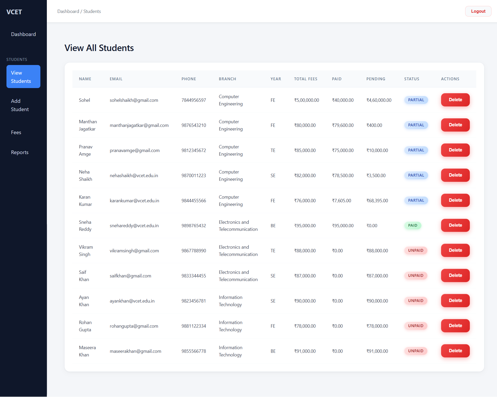
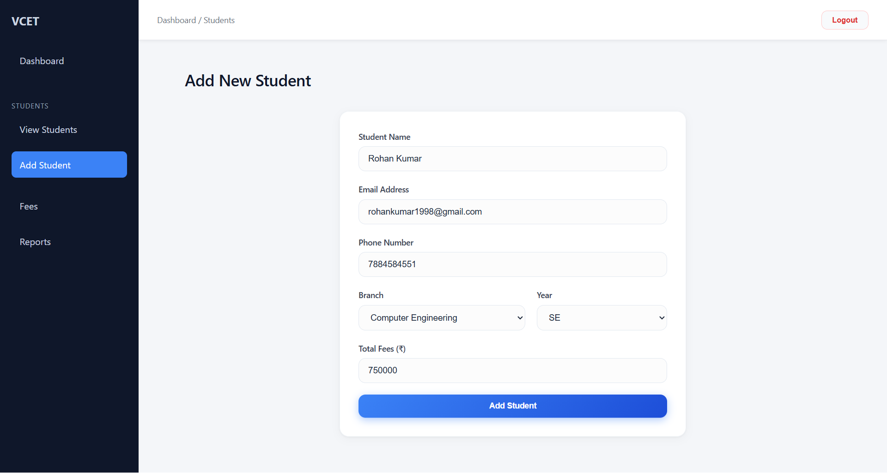
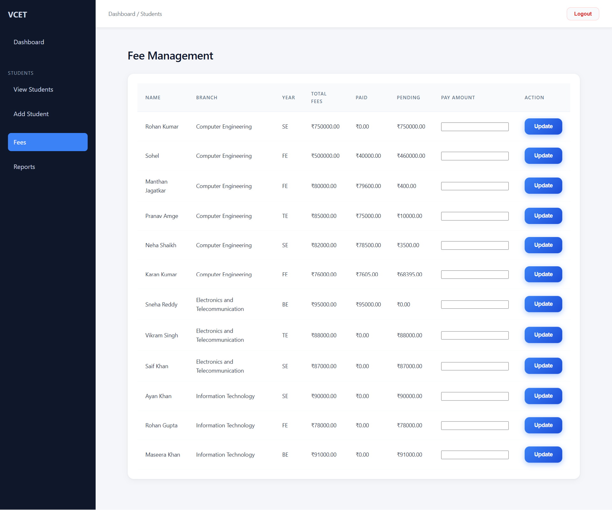

# Student Fee Management System

A full-stack SaaS-based Student Fee Management Portal built for **Vidyavardhini College of Engineering (VCET)**.

This system allows administrators to manage students, track fee payments, calculate pending amounts, and generate financial summaries securely.

---

## 🔐 Authentication & Security

- Email verification system
- JWT-based authentication
- Role-based access control (Admin/User)
- Secure Admin Portal Key verification
- Protected routes
- Session persistence using localStorage

---

## 📊 Core Features

### 👨‍🎓 Student Management
- Add new students
- Assign branch & year
- View all registered students
- Delete students with confirmation modal

### 💳 Fee Management
- Record payments
- Prevent overpayment
- Auto calculate:
  - Total Paid
  - Pending Amount

### 📈 Reports Dashboard
- Total Fees Collected
- Total Pending Fees
- Clean summary cards

### 🧠 Smart UI System
- Fixed Sidebar + Top Navbar layout
- Responsive design
- Modern corporate SaaS theme
- Status badges (Paid / Pending)
- Confirmation modals

---

## 🏗 Tech Stack

### Frontend
- React.js
- React Router DOM
- Context API
- Custom CSS Design System

### Backend
- Node.js
- Express.js
- MySQL
- JWT Authentication

---


## 🖼 Application Screenshots

### 🔑 Login Page


### 📝 Signup Page


### 📧 Email Verification


### 🔐 Admin Portal Key


### 📊 Dashboard


### 👨‍🎓 Students List


### ➕ Add Student


### 💳 Fee Management


### 📈 Reports Page


### ❌ Delete Confirmation Modal


---

## ⚙️ Installation Guide

### 1️⃣ Clone Repository
```bash
git clone https://github.com/YOUR_USERNAME/student-fee-management.git
```

---

### 2️⃣ Backend Setup
```bash
cd backend
npm install
npm start
```

---

### 3️⃣ Frontend Setup
```bash
cd frontend
npm install
npm start
```

---

## 🌟 Future Enhancements

- Export reports as PDF
- Student search & filtering
- Dark mode toggle
- Payment history timeline
- Analytics charts

---

## 👨‍💻 Author

**Shahiduddin Shaikh**  
Computer Engineering Student  
Vidyavardhini College of Engineering

---

## 📌 License

This project is developed for educational and academic purposes.
