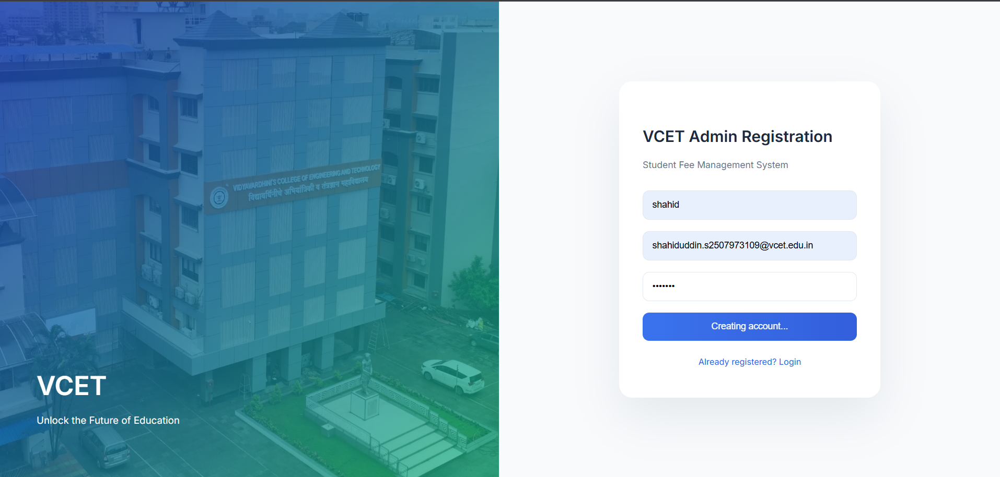
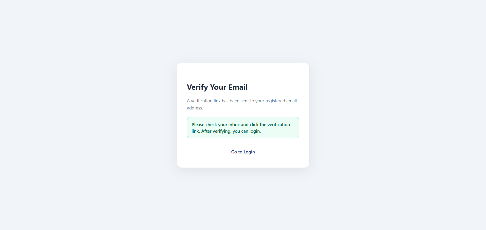
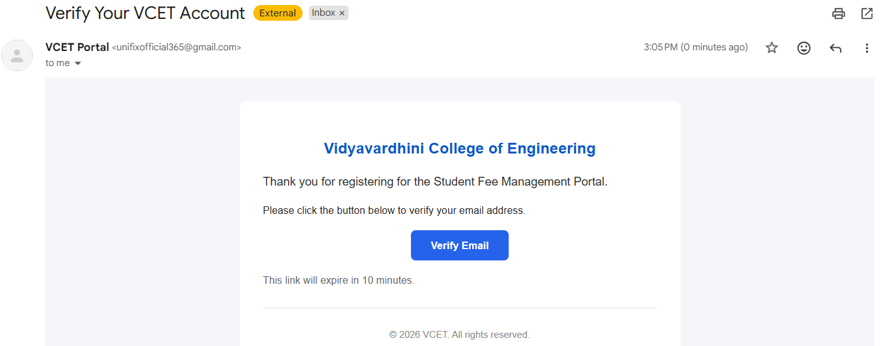
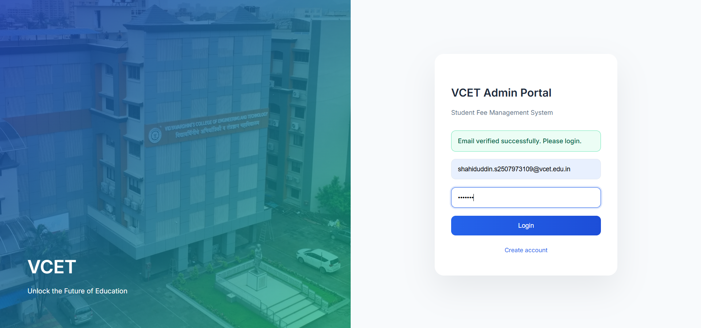
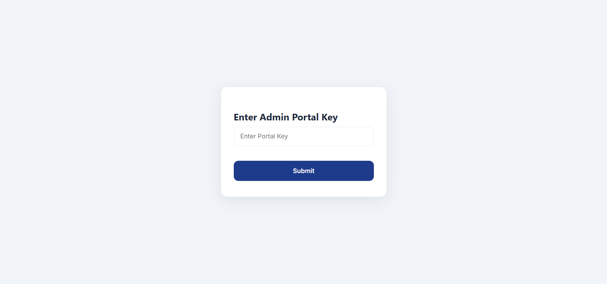
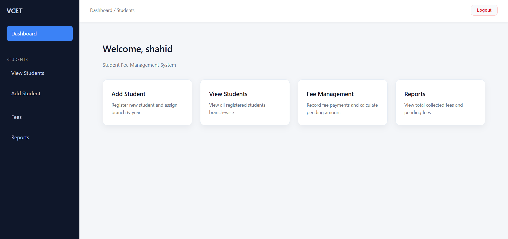
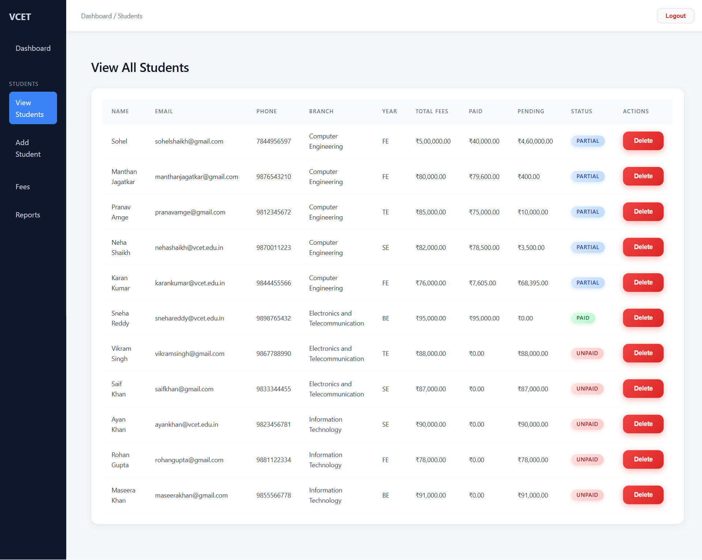
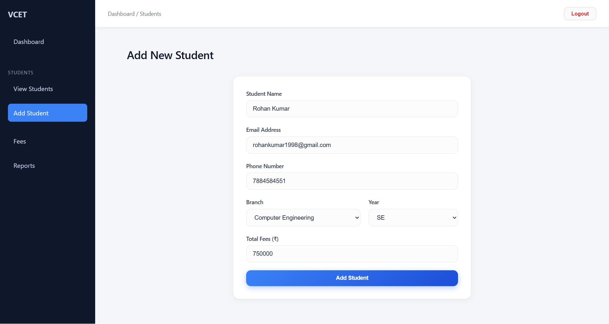
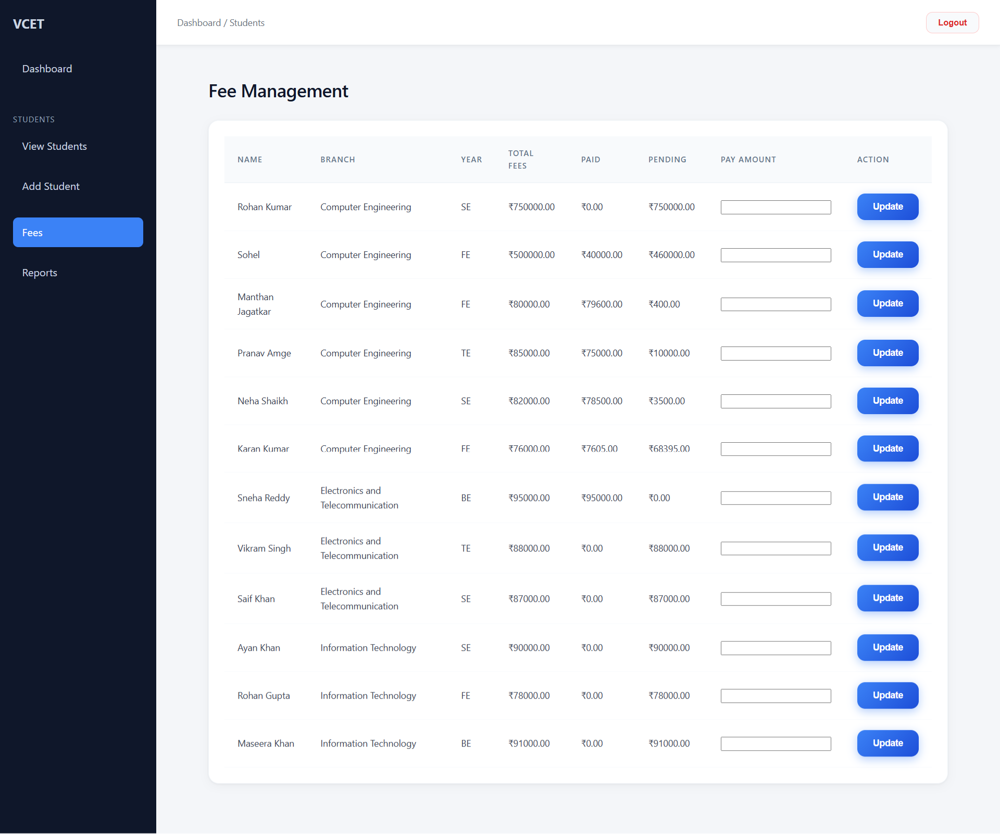
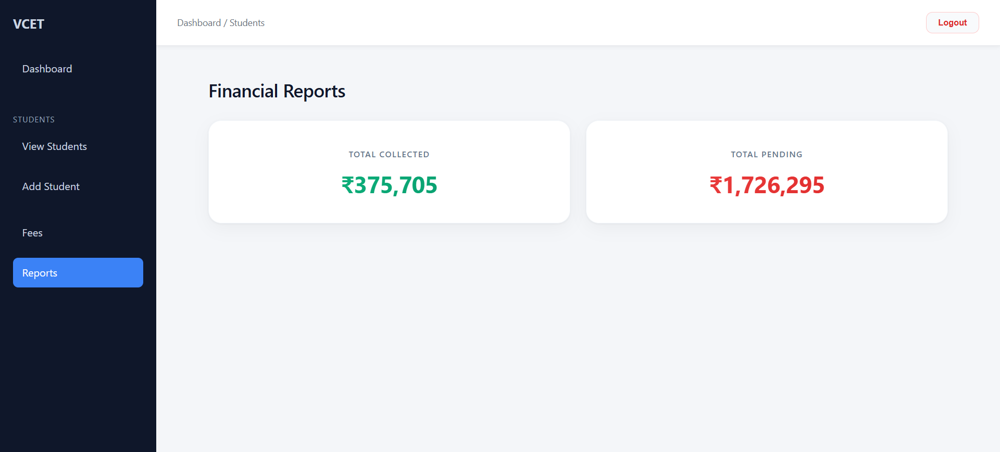

# Student Fee Management System

A full-stack SaaS-based Student Fee Management Portal built for **Vidyavardhini College of Engineering (VCET)**.

This system allows administrators to manage students, track fee payments, calculate pending amounts, and generate financial summaries securely.

---

##Authentication & Security

- Email verification system
- JWT-based authentication
- Role-based access control (Admin/User)
- Secure Admin Portal Key verification
- Protected routes
- Session persistence using localStorage

---

## Core Features

### Student Management
- Add new students
- Assign branch & year
- View all registered students
- Delete students with confirmation modal

### Fee Management
- Record payments
- Prevent overpayment
- Auto calculate:
  - Total Paid
  - Pending Amount

### Reports Dashboard
- Total Fees Collected
- Total Pending Fees
- Clean summary cards

### Smart UI System
- Fixed Sidebar + Top Navbar layout
- Responsive design
- Modern corporate SaaS theme
- Status badges (Paid / Pending)
- Confirmation modals

---

## Tech Stack

### Frontend
- React.js
- React Router DOM
- Context API
- Custom CSS Design System

### Backend
- Node.js
- Express.js
- MySQL
- JWT Authentication

---

## Application Screenshots

### Signup Page

### Email Verification

### Email Verification Mail

### Login Page

### Admin Portal Key

### Dashboard

### Students List

### Add Student

### Fee Management

### Reports Page

---

## Author

**Shahiduddin Shaikh**  
Computer Engineering Student  
Vidyavardhini College of Engineering

---
